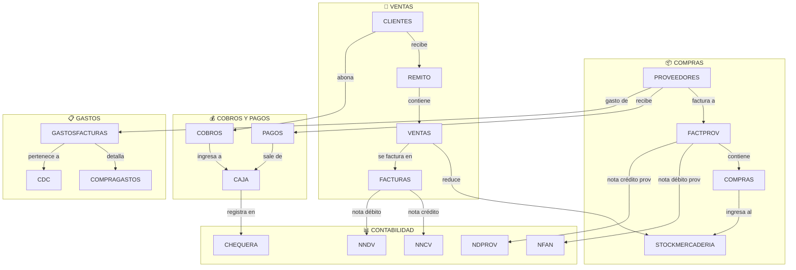

# Diagrama Visual - ALdia SQLite

## Nombre de la Base de Datos

| Propiedad | Valor |
|-----------|-------|
| **Motor** | SQLite (vía sql.js / WebAssembly) |
| **Archivo físico** | Ninguno - DB en memoria |
| **Persistencia** | `localStorage` con clave **`aldia_db`** |
| **Exportación** | `aldia_backup.sqlite` (archivo descargable) |
| **Capa JS** | `Web/js/db.js` (constante `DB`) |

---

## Diagrama ER Completo

```mermaid
erDiagram

    CLIENTES {
        TEXT cuit PK
        TEXT nombre
        TEXT domicilio
        TEXT localidad
        TEXT provincia
        TEXT cp
        TEXT telefono
        TEXT mail
        REAL saldo
    }

    PROVEEDORES {
        TEXT cuit PK
        TEXT nombre
        TEXT domicilio
        TEXT localidad
        TEXT provincia
        TEXT cp
        TEXT telefono
        TEXT mail
        REAL saldo
    }

    STOCKMERCADERIA {
        INTEGER codigo PK
        TEXT producto
        REAL cantidad
        TEXT unidad
        REAL preven
        REAL iva
        REAL precom
    }

    USUARIOS {
        INTEGER id PK
        TEXT username UK
        TEXT password
        TEXT rol
    }

    CDC {
        INTEGER id PK
        TEXT rubro
        REAL total
    }

    REMITO {
        INTEGER id PK
        TEXT cliente FK
        TEXT fecha
        REAL total
        REAL iva
    }

    VENTAS {
        INTEGER id PK
        INTEGER codigo FK
        TEXT producto
        REAL cantidad
        REAL precio
        TEXT unidad
        INTEGER nmov FK
        INTEGER idfactura FK
        TEXT cliente FK
        TEXT fecha
    }

    REMENTRE {
        INTEGER id PK
        INTEGER remito FK
        TEXT intermediario
        REAL cantidad
    }

    ENTREGAS {
        INTEGER id PK
        INTEGER remito FK
        TEXT detalle
        TEXT fecha
    }

    FACTURAS {
        INTEGER facturanumero PK
        TEXT cliente FK
        TEXT fecha
        REAL subtotal
        REAL iva
        REAL total
    }

    NNCV {
        INTEGER id PK
        TEXT cliente FK
        TEXT descripcion
        TEXT fecha
    }

    NNDV {
        INTEGER id PK
        TEXT cliente FK
        TEXT descripcion
        TEXT fecha
    }

    FACTPROV {
        INTEGER id PK
        TEXT proveedor FK
        TEXT fecha
        REAL subtotal
        REAL iva
        REAL total
    }

    COMPRAS {
        INTEGER id PK
        INTEGER codigo FK
        TEXT producto
        REAL cantidad
        REAL precio
        INTEGER factprov_id FK
        TEXT fecha
    }

    CONSCOM {
        INTEGER id PK
        INTEGER factprov_id FK
        INTEGER codigo FK
        TEXT producto
        REAL cantidad
        REAL precio
    }

    NFAN {
        INTEGER id PK
        TEXT proveedor FK
        REAL monto
        TEXT fecha
        TEXT referencia
        TEXT descripcion
    }

    NDPROV {
        INTEGER id PK
        TEXT proveedor FK
        REAL monto
        TEXT fecha
        TEXT referencia
        TEXT descripcion
    }

    NCP {
        INTEGER id PK
        TEXT proveedor FK
        TEXT fecha
        TEXT descripcion
    }

    GASTOSFACTURAS {
        INTEGER id PK
        TEXT proveedor FK
        TEXT numfactura
        TEXT fecha
        REAL subtotal
        REAL iva
        REAL total
        TEXT descripcion
        INTEGER cdc FK
    }

    COMPRAGASTOS {
        INTEGER id PK
        INTEGER gastos_id FK
        TEXT descripcion
        REAL monto
        REAL iva
    }

    MOVIMIENTOS_SIN_IMPUESTOS {
        INTEGER id PK
        INTEGER ref_id FK
        INTEGER codigo FK
        TEXT producto
        REAL cantidad
        REAL precio
        TEXT gasto
    }

    COBROS {
        INTEGER ordcobro PK
        TEXT cliente FK
        REAL monto
        TEXT fecha
        TEXT tipo
        TEXT referencia
    }

    PAGOS {
        INTEGER ordpago PK
        TEXT proveedor FK
        REAL monto
        TEXT fecha
        TEXT tipo
        TEXT referencia
    }

    CAJA {
        INTEGER id PK
        TEXT referencia
        TEXT fecha
        REAL debe
        REAL haber
        TEXT descripcion
    }

    CHEQUERA {
        INTEGER id PK
        TEXT numcheque
        INTEGER tipo
        REAL monto
        TEXT vencimiento
        TEXT banco
        TEXT cuit FK
        TEXT nombre
        TEXT descripcion
        TEXT pagado
    }

    FACNOREM {
        INTEGER id PK
        INTEGER codigo FK
        TEXT producto
        REAL cantnoretirada
        TEXT cliente FK
        TEXT fecha
        INTEGER nmov
    }

    REMNOFAC {
        INTEGER id PK
        INTEGER codigo FK
        TEXT producto
        REAL cantidad
        TEXT cliente FK
        TEXT fecha
        INTEGER idfactura FK
        INTEGER nmov
    }

    %% RELACIONES
    CLIENTES ||--o{ REMITO : "emite"
    CLIENTES ||--o{ VENTAS : "realiza"
    CLIENTES ||--o{ FACTURAS : "recibe"
    CLIENTES ||--o{ COBROS : "abona"
    CLIENTES ||--o{ NNCV : "nota_credito"
    CLIENTES ||--o{ NNDV : "nota_debito"
    CLIENTES ||--o{ FACNOREM : "factura_sin_remito"
    CLIENTES ||--o{ REMNOFAC : "remito_sin_factura"

    PROVEEDORES ||--o{ FACTPROV : "factura_a"
    PROVEEDORES ||--o{ PAGOS : "recibe_pago"
    PROVEEDORES ||--o{ NFAN : "nota_debito_prov"
    PROVEEDORES ||--o{ NDPROV : "nota_credito_prov"
    PROVEEDORES ||--o{ NCP : "nota_cargo"
    PROVEEDORES ||--o{ GASTOSFACTURAS : "gasto_de"

    STOCKMERCADERIA ||--o{ VENTAS : "se_vende_en"
    STOCKMERCADERIA ||--o{ COMPRAS : "se_compra_en"
    STOCKMERCADERIA ||--o{ MOVIMIENTOS_SIN_IMPUESTOS : "mov_sin_impuestos"
    STOCKMERCADERIA ||--o{ CONSCOM : "consignacion"
    STOCKMERCADERIA ||--o{ FACNOREM : "factura_sin_remito"
    STOCKMERCADERIA ||--o{ REMNOFAC : "remito_sin_factura"

    REMITO ||--o{ VENTAS : "contiene_items"
    REMITO ||--o{ REMENTRE : "entregas_parciales"
    REMITO ||--o{ ENTREGAS : "registra_entregas"

    FACTURAS ||--o{ VENTAS : "factura_venta"

    FACTPROV ||--o{ COMPRAS : "contiene_items"
    FACTPROV ||--o{ CONSCOM : "consignacion"

    GASTOSFACTURAS ||--o{ COMPRAGASTOS : "detalla_conceptos"
    GASTOSFACTURAS }o--|| CDC : "pertenece_rubro"
```



---

## Resumen de las 27 Tablas

| # | Tabla | Registros | Descripción | PK | FKs |
|---|-------|-----------|-------------|-----|-----|
| 1 | `clientes` | Variable | Clientes del sistema | `cuit` | - |
| 2 | `proveedores` | Variable | Proveedores del sistema | `cuit` | - |
| 3 | `stockmercaderia` | 8 (seed) | Productos en stock | `codigo` | - |
| 4 | `usuarios` | 3 (seed) | Usuarios con roles | `id` | - |
| 5 | `cdc` | 3 (seed) | Centros de Costo | `id` | - |
| 6 | `remito` | Variable | Cabecera de remitos | `id` | `cliente`→clientes |
| 7 | `ventas` | Variable | Items vendidos | `id` | `codigo`→stock, `nmov`→remito, `idfactura`→facturas |
| 8 | `rementre` | Variable | Entregas parciales por intermediario | `id` | `remito`→remito |
| 9 | `entregas` | Variable | Detalle de entregas | `id` | `remito`→remito |
| 10 | `facturas` | Variable | Facturas emitidas a clientes | `facturanumero` | `cliente`→clientes |
| 11 | `nncv` | Variable | Notas de Crédito (ventas) | `id` | `cliente`→clientes |
| 12 | `nndv` | Variable | Notas de Débito (ventas) | `id` | `cliente`→clientes |
| 13 | `factprov` | Variable | Facturas de proveedores | `id` | `proveedor`→proveedores |
| 14 | `compras` | Variable | Items comprados | `id` | `codigo`→stock, `factprov_id`→factprov |
| 15 | `conscom` | Variable | Compras en consignación | `id` | `factprov_id`→factprov, `codigo`→stock |
| 16 | `nfan` | Variable | Notas de Débito (proveedores) | `id` | `proveedor`→proveedores |
| 17 | `ndprov` | Variable | Notas de Crédito (proveedores) | `id` | `proveedor`→proveedores |
| 18 | `ncp` | Variable | Notas de Cargo (proveedores) | `id` | `proveedor`→proveedores |
| 19 | `gastosfacturas` | Variable | Facturas de gastos generales | `id` | `proveedor`→proveedores, `cdc`→cdc |
| 20 | `compragastos` | Variable | Conceptos detallados de gastos | `id` | `gastos_id`→gastosfacturas |
| 21 | `movimientos_sin_impuestos` | Variable | Movimientos sin comprobante fiscal (no gravados) | `id` | `codigo`→stock, `ref_id`→remito/factura |
| 22 | `cobros` | Variable | Cobros a clientes | `ordcobro` | `cliente`→clientes |
| 23 | `pagos` | Variable | Pagos a proveedores | `ordpago` | `proveedor`→proveedores |
| 24 | `caja` | Variable | Movimientos de caja | `id` | - |
| 25 | `chequera` | Variable | Cheques emitidos/cobrados | `id` | `cuit`→clientes/proveedores |
| 26 | `facnorem` | Variable | Facturas sin remito (detalle) | `id` | `codigo`→stock, `cliente`→clientes |
| 27 | `remnofac` | Variable | Remitos sin factura (detalle) | `id` | `codigo`→stock, `cliente`→clientes |

---

## Flujo de Datos Principal



---

## Arquitectura de Persistencia

```mermaid
flowchart LR
    subgraph NAVEGADOR["🌐 Navegador"]
        HTML[index.html] --> JS[js/app.js]
        JS --> MOD[módulos/*.js]
        MOD --> DB[db.js - const DB]
    end

    subgraph SQLJS["⚙️ sql.js (WASM)"]
        DB -->|query/run| SQLITE[(SQLite en memoria)]
    end

    subgraph PERSISTENCIA["💾 Persistencia"]
        DB -->|save() base64| LS[localStorage: aldia_db]
        DB -->|exportDB() blob| DL[Descarga .sqlite]
        DB -->|importDB(file)| DL
    end

    LS -.|"on load"|-> SQLJS
```

---

## Notas Importantes

1. **Sin Foreign Keys reales**: SQLite en sql.js no enforcea FKs. Las relaciones son lógicas (por nombre de campo).
2. **Autoguardado**: Cada `DB.run()` dispara `DB.save()` que serializa toda la DB a base64 en localStorage.
3. **Límite localStorage**: ~5-10 MB según el navegador. Si se supera, se descarga un backup automáticamente.
4. **Roles de usuario**: administrador, caja, encargado_ventas, encargado_compras, encargado_deposito, auditor, finanzas.
5. **Moneda**: Pesos argentinos (ARS) con formato `$ 1.234,56`.
